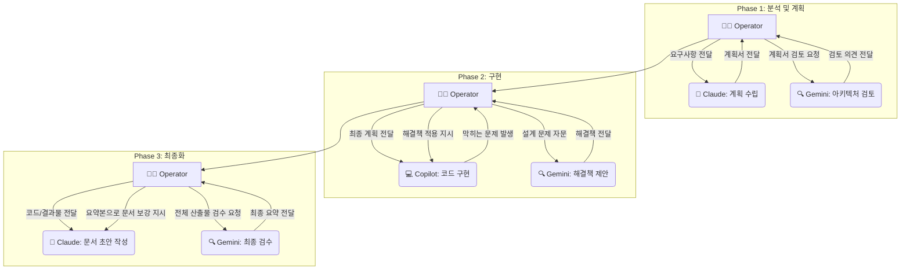

# AI 에이전트 협업 워크플로우 가이드

## 1. 프로젝트 목적

이 프로젝트는 여러 전문 AI 에이전트(Claude, Gemini, Copilot)를 활용하여 복잡한 소프트웨어 개발 과업을 수행할 때, **사람(개발자)의 생산성과 결과물의 품질을 극대화하기 위한 운영 매뉴얼**입니다.

이 워크플로우는 'AI가 스스로 협업하는 자동화 시스템'이 아니라, **'사람이 각 AI의 강점을 전략적으로 활용하도록 돕는 가이드북'**을 지향합니다.

### 핵심 원칙
- **사람 중심 중재 (Human-in-the-Loop):** 모든 상호작용은 사람이 중심이 되어 AI에게 작업을 지시하고 결과를 전달합니다.
- **순차 활용 우선 (Sequential First):** 하나의 작업은 하나의 AI가 끝까지 책임지는 것을 기본으로 합니다.
- **전략적 개입 (Strategic Intervention):** 아키텍처 검토 등 꼭 필요한 시점에만 다른 전문가 AI를 '컨설턴트'처럼 호출하여 품질을 높입니다.
- **상태 관리 (`project_status.md`):** 모든 작업의 맥락을 `project_status.md` 파일에 기록하여 정보 손실을 방지합니다.

## 2. Agent 간 협업 업무 분장

각 AI 에이전트는 명확히 정의된 역할을 수행하여 시너지를 창출합니다.

| 에이전트 | 핵심 강점 | 주요 역할 (전문 분야) |
| :--- | :--- | :--- |
| **Claude** | 체계적인 장문 생성, 계획 수립 | 🔹 **기획자 (Planner) / 기술 작가 (Writer)** 요구사항 분석, 개발 계획 수립, 테스트 케이스 설계, 최종 문서화를 담당합니다. |
| **Gemini** | 심층 분석, 추론, 아키텍처 설계 | 🔹 **아키텍트 (Architect) / 분석가 (Analyst)** 기술 계획 검토, 아키텍처 설계, 복잡한 알고리즘 분석, 최종 산출물 검수를 담당합니다. |
| **Copilot** | 빠른 코드 생성, 실행, 자동화 | 🔹 **구현자 (Implementer) / 실행자 (Executor)** PoC 개발, 실제 코드 작성, 테스트 실행, 빌드/배포 자동화를 담당합니다. |

## 3. 상호 워크플로우 차트

이 워크플로우는 **사람(OPERATOR)** 의 중재 하에 단계적으로 진행됩니다.

**[중요]** 모든 화살표는 사람이 직접 컨텍스트(`project_status.md` 포함)를 전달하는 수동 작업을 의미합니다.

## 4. 각 단계별 사용 방법

이 섹션은 각 단계에서 어떤 AI를 어떻게 활용하는지 요약합니다.
**➡️ 더 상세한 실제 프로젝트 적용 예시는 [워크플로우 사용 예시](./agent-doc/workflow_example.md) 문서를 참고하십시오.**

### Phase 0: 기술 검증 (PoC)

1.  **To Copilot:** 아이디어를 빠르게 검증하기 위해 "이 기술로 30분 안에 간단한 PoC 코드를 만들어줘." 라고 요청합니다.
2.  **To Gemini (선택):** Copilot의 결과물이 기술적으로 타당한지, 더 나은 대안은 없는지 검토를 요청합니다.

### Phase 1: 분석 및 전략 수립

1.  **To Claude:** 구체적인 요구사항을 전달하며 "상세 기술 계획, WBS, 리스크 분석이 포함된 문서를 만들어줘." 라고 요청합니다.
2.  **To Gemini:** Claude가 만든 계획서와 `project_status.md`를 함께 전달하며 "이 계획의 아키텍처 문제점과 테스트 전략을 제안해줘." 라고 요청하여 계획의 품질을 높입니다.
3.  **To Copilot:** 최종 확정된 계획의 핵심 기능을 일부 구현시켜 실현 가능성을 최종 확인합니다.

### Phase 2: 마일스톤 기반 구현

1.  **To Gemini (마일스톤 시작 시):** "이번 마일스톤의 기능은 [기능 요약]이야. 테스트 전략을 제안해줘." 라고 요청하여 테스트 방향을 설정합니다.
2.  **To Claude:** Gemini의 테스트 전략에 맞춰 "BDD 스타일 테스트 케이스 뼈대를 작성해줘." 라고 요청합니다.
3.  **To Copilot [핵심 작업]:** 설계 문서와 테스트 케이스를 전달하며 "이 설계에 맞춰 실제 코드를 구현하고 모든 테스트를 통과시켜줘." 라고 요청합니다.
4.  **(문제가 생기면) To Gemini:** Copilot이 해결하기 어려운 설계 문제가 발생하면, Gemini에게 해당 부분의 설계를 구체적으로 자문합니다.

### Phase 3: 최종화 및 문서화

1.  **To Copilot:** "이 프로젝트를 위한 CI/CD 파이프라인과 Dockerfile을 만들어줘." 와 같이 배포 자동화 스크립트 생성을 요청합니다.
2.  **To Gemini:** 완성된 모든 산출물을 전달하며 최종 검수를 요청하고, 문서화에 필요한 핵심 정보를 요약해달라고 합니다.
3.  **To Claude:** Gemini의 요약본과 Git 변경 로그를 바탕으로 사용자 매뉴얼, API 명세 등 최종 문서를 작성하도록 지시합니다.

### ⚠️ 모든 단계를 위한 필수 도구

- **`project_status.md`:** 각 에이전트에게 작업을 요청할 때 **항상** 이 파일을 최신 상태로 업데이트하여 함께 전달해야 컨텍스트 손실을 막을 수 있습니다.
- **품질 게이트 체크리스트:** 다음 단계로 넘어가기 전, 이전 결과물이 최소 요구사항을 만족하는지 스스로 검증하는 습관을 들여야 합니다.

## 5. 팀 규모별 적용 전략

이 워크플로우의 효과는 팀 규모에 따라 다릅니다.

| 팀 규모 | 권장 전략 | 비고 |
| :--- | :--- | :--- |
| **1인 개발자** | 순차 활용만 (Phase 0 생략 가능) | Agent 전환 오버헤드가 이득보다 클 수 있음 |
| **2-5인 팀** | 전체 워크플로우 활용 권장 ✅ | **가장 효과적인 규모** - 역할 분담 명확 |
| **5인+ 팀** | 소규모 팀부터 시작 → 점진적 확대 | 전체 조직 도입 전 2-3인 Strike Team으로 시범 운영 |

## 6. 한계 및 주의사항 ⚠️

이 워크플로우는 **4개 AI 에이전트의 합의**를 통해 검증되었으나, 다음 제약사항이 있습니다:

### 신뢰도: 70-75%

현재까지의 검증 결과, 이 워크플로우는 **특정 영역에서는 효과적**이지만 모든 상황에 적용 가능한 것은 아닙니다.

### 검증 범위

| 영역 | 상태 | 설명 |
| :--- | :--- | :--- |
| ✅ **검증됨** | 문서 작업, 계획 수립, 신규 프로젝트 | 효율성 증가 확인됨 |
| ⚠️ **부분 검증** | 대규모 코드베이스(100k+ lines), 레거시 리팩토링 | Phase 0.5 전략 추가 (섹션 8 참조), 파일럿 권장 |
| ✅ **개선 완료** | 실패 복구 프로토콜 | team_ground_rules.md 섹션 3.2 참조 |
| ✅ **개선 완료** | 측정 가능한 품질 메트릭 | metrics_template.md 문서 제공 |
| ⚠️ **미검증** | 실시간 시스템, 하드웨어 제어 | 도메인 특수성으로 추가 검증 필요 |

### 권장 도입 방법

1. **파일럿 프로젝트로 시작**: 2-5인 팀에서 **2주간 비핵심 기능** 개발로 효과 검증
2. **측정 지표 설정**: [metrics_template.md](./agent-doc/metrics_template.md) 활용하여 실제 시간 절감, 버그 발생률 등을 프로젝트 전후 비교
3. **점진적 확대**: 효과가 입증되면 더 복잡한 프로젝트로 확장
4. **레거시 적용 시**: [agent-workflow-plan.md 섹션 8](./agent-doc/agent-workflow-plan.md#8-대규모-코드베이스-및-레거시-프로젝트-적용-전략) 참조하여 Phase 0.5부터 시작

### 주요 주의사항

- ❌ **자동 협업 기대 금지**: AI들이 자동으로 대화하지 않습니다. 모든 전달은 사람이 수동으로 처리합니다.
- ❌ **오버헤드 간과 금지**: Agent 전환마다 10-15분의 중개 시간이 필요합니다 (~20-25% 오버헤드, 역할 재분배로 개선).
- ✅ **현실적 기대**: 40-50% 효율 증가는 **가설**입니다. metrics_template.md로 실측하여 검증하십시오.
- ⚠️ **실패 복구 준비**: [team_ground_rules.md 섹션 3.2](./agent-doc/team_ground_rules.md#32-agent-출력-품질-실패-failure-recovery-protocol) 숙지 필수
